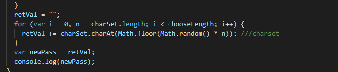

# Click Password
This is a javascript project to generate a randomized password.

## Getting Started

Click the button

# Adding a unique id to each note

# Link
* [Deployed link](https://alix1713.github.io/ClickPassword/)
* [Github Repo](https://github.com/Alix1713/ClickPassword)

## Built With

* [HTML](https://www.w3schools.com/html/html_intro.asp)
* [UC Berkeley Extension Program](https://extension.berkeley.edu/)

## Alix Friedman

* [My GitHub](https://www.github.com/Alix1713)
* [My LinkedIn](https://www.linkedin.com/in/alix1713)

## Acknowledgments

Thanks to Jerome for taking the time to go over this with me after class.
